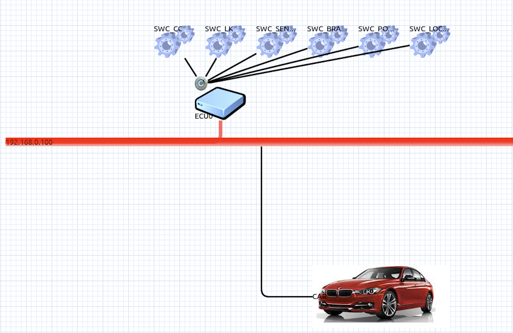
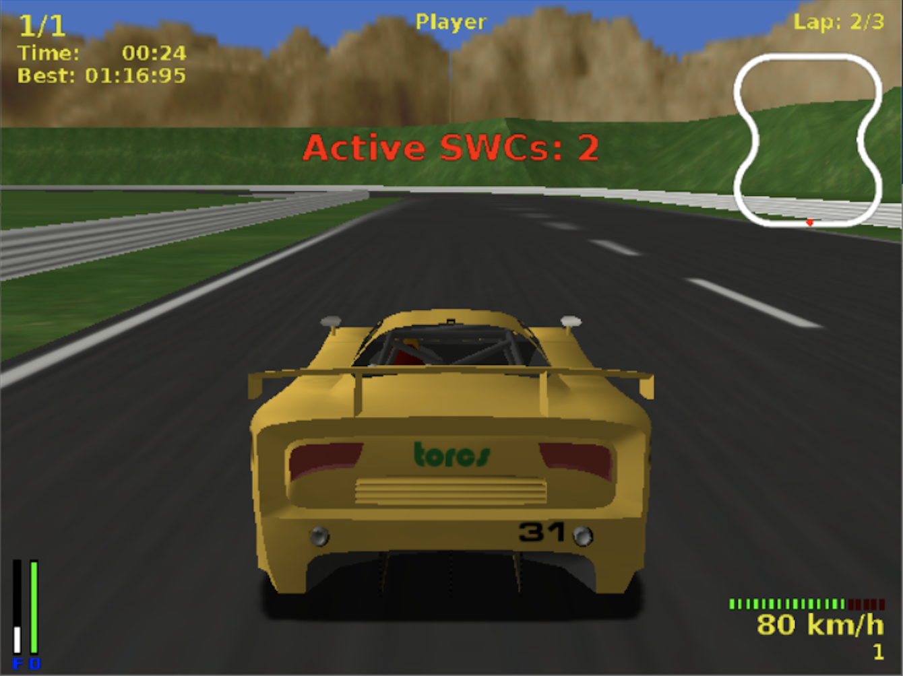
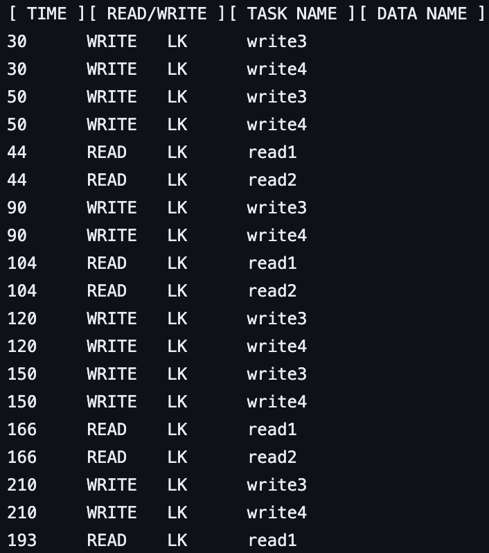
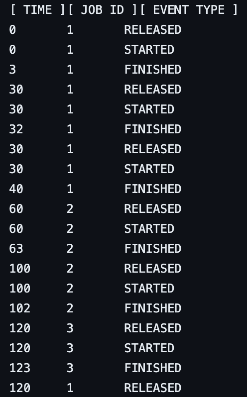

**All the modifications are in the 201914388 directory**
# Computer Modeling Final Project: Simulating Cyber-Physical Systems using CPSim
**Author:** 2019-14388 Kim Minseong

---

## Abstract
This project explores the application of CPSim for simulating cyber-physical systems (CPS) with a focus on vehicle dynamics. Utilizing the Real Time Ubiquitous Systems Lab's CPSim and Vehicle Simulator, the project aims to design, simulate, and analyze a cyber system modeled after a vehicle's control system. Two key tasks were undertaken: optimizing vehicle performance to reduce lap times and implementing logging functions for data analysis.

---

## Introduction

### Purpose of the Project
This project, centered around the Real Time Ubiquitous Systems Lab (RUBIS)'s CPSim and Vehicle Simulator tools, aims to explore the complex domain of cyber-physical systems (CPS) through the lens of practical simulation. The primary objective is to design, simulate, and analyze a cyber system, specifically modeled to mimic a vehicle's control system, using CPSim. CPSim, a tool adept at simulating the cyber aspect of CPS, comprises two major components: the CPSim GUI for system design and visualization, and the CPSim Engine, tasked with maintaining functional and temporal correctness during task execution. In parallel, the Vehicle Simulator, based on the Torcs simulator, is employed to replicate the physical system, thus enabling a holistic simulation that accurately represents both cyber and physical elements of the CPS in unison.

### Project Structure and Goals
The project is methodically divided into two principal tasks. The first task is dedicated to optimizing the vehicle's performance, primarily to reduce lap times, thereby illustrating the application of cyber-physical system principles in enhancing efficiency. The second task underscores the importance of data logging for information retrieval. It involves the practical implementation of logging functions using the CPSim Engine, which entails capturing critical data such as task execution times, completion times, and any operational anomalies.

### Significance and Expected Outcomes
Engaging in these tasks provides not only a hands-on application of theoretical concepts learned in class but also imparts valuable insights into the complexities and challenges inherent in the design and operation of cyber-physical systems. The ultimate aim of this project is to effectively simulate a vehicle system that excels in performance efficiency while also demonstrating robustness and reliability in its operations. Due for completion on December 4, 2023, this project is anticipated to culminate in a comprehensive understanding of CPS, spanning from its theoretical foundations to the practical challenges and solutions encountered in designing and implementing such intricate systems.

### Background Theory: Functionally and Temporally Correct Simulation of Cyber-Systems for Automotive Systems
The core of this project is anchored in the principles of functionally and temporally correct simulation of cyber-systems, with a specific emphasis on automotive systems. This approach is essential due to the limitations of traditional simulation tools in the automotive industry, which often fail to accurately model the timing behaviors of cyber-systems, such as varying execution times and task preemptions. This results in a significant gap between the predicted and actual control performance of these systems.

#### Cyber-System Simulation for Control Performance Prediction
Addressing this gap, the CPSim approach ensures the functional and temporal accuracy of simulated cyber-side tasks, mirroring the actual system's performance. This is vital for predicting control performance in the design phase, and CPSim's methodology offers a substantial enhancement in real-time simulation capacity.

#### Structural Components and Constraints in CPSim
CPSim's architecture involves each control task in the cyber-system being structured as a periodic task, represented as a five-tuple: 

$τ_i = (F_i, φ_i, P_i, C_i^best, C_i^worst)$

where `F_i` is the function executed by `τ_i`, `φ_i` is the task offset, and `C_i^best, C_i^worst` represent the best and worst execution times. The simulation also considers the relationship between execution times on the PC and the Electronic Control Unit (ECU), incorporating mechanisms like tagged data reading and delayed data writing for enhanced simulation accuracy.

#### Overcoming Scheduling Constraints and Non-Determinism
A critical aspect of CPSim is its ability to overcome the rigid scheduling constraints of traditional models. It achieves this by focusing on data and time correctness exclusively at physical interaction points. This approach involves three main scheduling constraints: physical-read, physical-write, and producer-consumer constraints. Furthermore, the use of tagged data read and delayed data write mechanisms significantly enhances the flexibility in job scheduling, allowing the simulation PC to effectively replicate the functional and temporal effects of the real cyber-system.

#### Two-Step Approach: Offline Guider and Online Progressive Scheduling
To handle the non-deterministic nature of job start and finish times, CPSim adopts a two-step strategy. Initially, an offline guider—a job-level precedence graph—captures the constraints in non-deterministic forms. Then, in the online phase, jobs are scheduled on the simulation PC guided by the offline guider. This process, known as online progressive scheduling, efficiently resolves non-determinism, ensuring accurate simulation outcomes.

## Simulation Setup

The target system is a real cyber-system handling 6 tasks: Cruise Control (CC), Lane Keeping (LK), Sensing, Brake, Power, and Local. The CPSim GUI is used to design the cyber-system, which is then simulated using the CPSim Engine. The Vehicle Simulator is used to simulate the physical system, which is then connected to the cyber-system via the CPSim Engine. The CPSim Engine is responsible for maintaining functional and temporal correctness during task execution.

### Simulated Model Design

  
*Figure: Simulated Model Design*

### Default Parameters

|            |   CC   |   LK   | SENSING | BRAKE | POWER | LOCAL |
|------------|:------:|:------:|:-------:|:-----:|:-----:|:-----:|
| Period, Deadline      | 500    | 500    | 500    | 500   | 500   | 500   |
| Execution Time        | 50     | 50     | 100    | 100   | 100   | 100   |
| Read Constraint       | Y      | Y      | N      | N     | N     | N     |
| Write Constraint      | Y      | Y      | N      | N     | N     | N     |

*Table: Default Parameters*

## Data & Results

### Speeding Up the Vehicle

The first task involves optimizing the vehicle's performance to reduce lap times. The constraints for the simulation were given as:

- Velocity ≤ 80
- Period ∈ [20, 500]
- Execution time ≥ 20
- If period ∈ (250, 500], utilization ≥ 0.1
- If period ∈ (100, 250], utilization ≥ 0.2
- If period ∈ (0, 100], utilization ≥ 0.5
- Unit stride = 10

This is achieved by modifying the cyber-system's design to reduce the execution times of the tasks as shown in the revised parameters table. This set of parameters successfully achieved a stable velocity of 80km/h, with the vehicle's oscillation remaining imperceptible to the naked eye.

#### Revised Parameters

|            |   CC   |   LK   | SENSING | BRAKE | POWER | LOCAL |
|------------|:------:|:------:|:-------:|:-----:|:-----:|:-----:|
| Period, Deadline      | 100    | 60     | 500    | 500   | 500   | 500   |
| Execution Time        | 20     | 30     | 50     | 50    | 50    | 50    |
| Read Constraint       | Y      | Y      | N      | N     | N     | N     |
| Write Constraint      | Y      | Y      | N      | N     | N     | N     |

*Table: Revised Parameters*

  
*Figure: Torcs Simulator Execution*

### Logging Data

The second task involves implementing logging functions using the CPSim Engine. This includes capturing critical data like data read and write, job release, execution start and finish, and deadline miss that occur during operation.

#### Data Read and Write

The `task_read_write_logger` function was implemented in the `Logger` class to log data read and write events. The function is called whenever a job reads or writes data. The function logs the job's ID, data ID, and the time of the event. The data is printed every time the function is called, to `201914388_read_write.log` in the `Log` folder. The function used `global_object::tagged_data_read` and `global_object::delayed_data_write` to access the data read and write events.

  
*Figure: Data Read and Write Events*

#### Job Release, Execution Start, Finish, and Deadline Miss

The `real_cyber_schedule_logger` function was implemented in the `Logger` class to log job release, execution start, finish, and deadline miss events. The function is called whenever a job is released, starts execution, finishes execution, or misses its deadline. The function logs the job's ID, event type, and the time of the event. The data is printed every time the function is called, to `201914388_schedule.log` in the `Log` folder.

  
*Figure: Job Events*

## Discussion

This study highlights several key aspects of cyber-physical system simulations using CPSim. Firstly, the optimization of vehicle performance revealed the intricacies of balancing multiple parameters such as execution time, period, and system constraints. The reduction in lap times was a direct outcome of fine-tuning these parameters, showcasing the simulator's precision and effectiveness.

Secondly, the logging task underscored the significance of data collection and analysis in understanding and optimizing CPS performance. The ability to log critical data like task execution times, completion times, and any anomalies provided valuable insights into the system's functioning and potential areas for improvement.

Furthermore, the project shed light on the challenges inherent in simulating complex systems. The necessity to maintain functional and temporal correctness, especially in a system as dynamic as a vehicle's control system, was a constant focus. The adaptability and flexibility of CPSim in this regard were noteworthy, demonstrating its suitability for detailed and accurate CPS modeling.

---

## Conclusion

The completion of this project has provided substantial insights into the field of cyber-physical systems, particularly in the context of automotive systems. The successful simulation of a vehicle control system using CPSim illustrates the potential of advanced simulation tools in accurately modeling and analyzing complex cyber-physical interactions. The project has demonstrated that with the right tools and methodologies, it is possible to not only predict but also enhance system performance, thereby contributing to the advancement of CPS technologies. This experience has underscored the importance of detailed simulation and data analysis in the development and optimization of CPS, paving the way for future innovations in this dynamic field.

---

## References

- K.-S. We, S. Kim, W. Lee, and C.-G. Lee, "Functionally and Temporally Correct Simulation of Cyber-Systems for Automotive Systems," in *2017 IEEE Real-Time Systems Symposium (RTSS)*, Paris, France, 2017, pp. 68-79, doi: 10.1109/RTSS.2017.00014.

